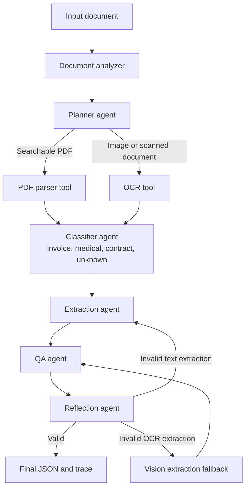
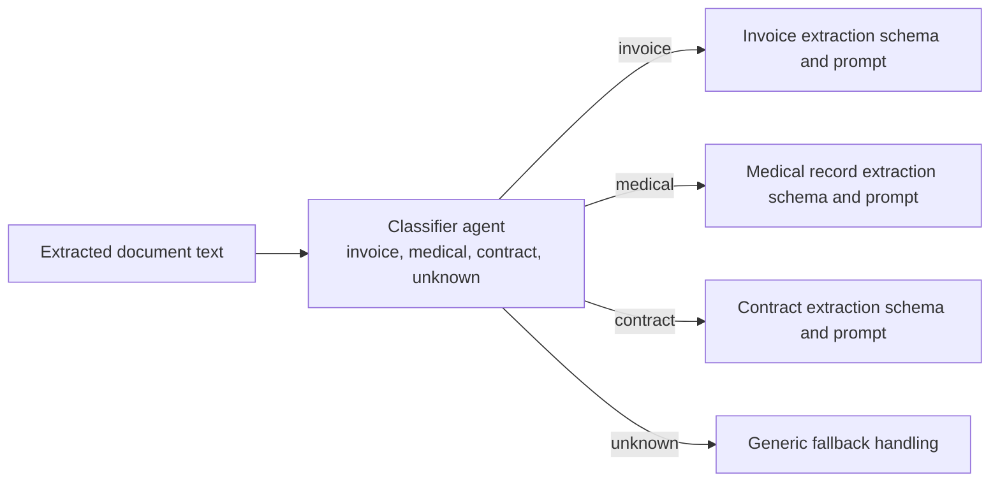

# Agentic Document Processing Agent

An agentic AI application that extracts structured data from unstructured documents such as invoices, medical records, and contracts.

The project uses LangGraph to orchestrate a multi-step document workflow: inspect the input, plan the extraction route with an LLM-assisted planner and deterministic fallback, call a document tool, classify the document, extract structured fields with an LLM, validate the result, and either finalize or retry through a reflection step.

## Quick Start

```bash
python -m venv .venv
source .venv/bin/activate
pip install -r requirements.txt
cp .env.example .env
```

Add your Groq API key to `.env`, then run:

```bash
python -m src.main --file sample_docs/invoice_simple.pdf --show-json
pytest -q
python evaluation/evaluate.py --scenarios evaluation/scenarios.json
```

OCR scenarios also require Tesseract OCR to be installed. See the setup section below for macOS and Ubuntu/Debian commands.

## Domain

This project implements the **Document Processing Agent** option from the assignment.

Supported input types:

- Searchable PDFs
- Scanned PDFs
- Image documents: `png`, `jpg`, `jpeg`

Supported document categories:

- Invoice
- Medical record / discharge summary
- Contract
- Unknown fallback

## Architecture

```text
src/
+-- agents/      # planner, classifier, extractor, QA, reflector, vision fallback
+-- graph/       # LangGraph state, workflow, routing
+-- prompts/     # system prompts and prompt factory
+-- schemas/     # Pydantic structured output schemas
+-- tools/       # PDF parser, OCR, document analyzer
+-- ui/          # Streamlit UI
+-- utils/       # logging and trace writing
+-- config.py    # environment-driven model config
+-- main.py      # CLI entry point
```



### Classifier Agent

The classifier agent decides which document-specific extraction route to use after text has been collected from the PDF parser or OCR tool.



Classifier agent outputs:

- `invoice`
- `medical`
- `contract`
- `unknown`

## Key Features

- LangGraph-based agent workflow.
- Tool/function calls for document analysis, PDF parsing, OCR, and optional vision extraction.
- LLM classification and structured extraction through Groq and LangChain.
- Pydantic schemas for structured output parsing.
- Provider tool-call recovery for structured-output failures that still contain usable JSON.
- Chunked extraction and merge for large searchable PDF text.
- Document-specific prompts for invoices, contracts, and medical records.
- LLM-assisted planner with deterministic metadata-rule fallback.
- QA (Quality Assurance) and reflection loop for validation, retry, and fallback decisions.
- Per-run JSON traces saved under `logs/runs/`.
- Lightweight evaluation across representative scenarios.
- Streamlit UI and Dockerfile included.

## Requirements

- Python 3.11 recommended.
- Tesseract OCR installed on the system.
- Groq API key.

## Setup

Create and activate a Python environment:

```bash
python -m venv .venv
source .venv/bin/activate
```

Or with Conda:

```bash
conda create --prefix ./.venv python=3.11 -y
conda activate ./.venv
```

Install Tesseract OCR.

macOS:

```bash
brew install tesseract
```

Ubuntu/Debian:

```bash
sudo apt-get update
sudo apt-get install -y tesseract-ocr
```

Install Python dependencies:

```bash
pip install -r requirements.txt
```

Configure environment variables:

```bash
cp .env.example .env
```

Get a Groq API key:

1. Go to the [Groq Console](https://console.groq.com/).
2. Sign in or create a Groq account.
3. Open the API Keys section for your selected project.
4. Create a new API key and copy it immediately.
5. Keep the key private. Do not commit `.env` or paste the key into source files.

Groq's official quickstart also recommends setting the key as the `GROQ_API_KEY` environment variable.

Edit `.env` and add your key:

```env
GROQ_API_KEY=your_groq_api_key_here
GROQ_MODEL=llama-3.1-8b-instant
GROQ_FALLBACK_MODELS=qwen/qwen3.6-27b
GROQ_TEMPERATURE=0.1
LOG_LEVEL=INFO
```

`GROQ_TEMPERATURE` defaults to `0.1` in the application config to keep classification and extraction mostly deterministic.

## Large Documents and Fallbacks

Searchable PDFs are parsed page by page with page markers. If extracted PDF text is large enough, the extraction agent processes the text in page-aware chunks and merges the chunk outputs into one final structured result. This keeps the normal small-document path unchanged while reducing large-prompt failures.

Scanned PDFs and image files use OCR first. If OCR output fails validation, the workflow can try a vision fallback. For PDF vision fallback, only the first PDF page is rendered to a PNG image before sending it to the multimodal model, which avoids uploading a large raw PDF payload.

For `unknown` documents, the system uses the generic `DocumentExtraction` fallback schema and does not force invoice, contract, or medical fields.

## Run the Agent

Health check:

```bash
python -m src.main
```

Process a sample PDF:

```bash
python -m src.main --file sample_docs/invoice_simple.pdf --show-json
```

Other sample documents:

```bash
python -m src.main --file sample_docs/medical_discharge.pdf --show-json
python -m src.main --file sample_docs/contract_nda.pdf --show-json
python -m src.main --file sample_docs/invoice_test_0002.jpg --show-json
python -m src.main --file sample_docs/invoice_test_0007.jpg --show-json
python -m src.main --file sample_docs/test_sample.pdf --show-json
```

Each CLI run with `--file` saves a trace JSON file under:

```text
logs/runs/
```

## Run the Streamlit UI

```bash
python -m streamlit run src/ui/app.py
```

Open:

```text
http://localhost:8501
```

The UI accepts PDF and image uploads, displays the extraction summary and structured JSON, shows agent trace logs, and saves the run trace under `logs/runs/`.

## Run Evaluation

```bash
python evaluation/evaluate.py --scenarios evaluation/scenarios.json
```

The evaluator runs representative documents through the LangGraph workflow and writes:

```text
evaluation/evaluation_results.json
```

It checks:

- Expected document type.
- Expected extraction tool.
- Required structured fields.
- QA quality score.

QA means Quality Assurance. In this project, the QA agent checks the extracted structured output for required fields, low-confidence values, extraction warnings, and whether the result is good enough to finalize or should be retried.

## Docker

Build:

```bash
docker build -t agentic-document-agent .
```

Run:

```bash
docker run --rm -p 8501:8501 --env-file .env agentic-document-agent
```

Open:

```text
http://localhost:8501
```

## Deliverables

- Code: `src/`
- Requirements: `requirements.txt`
- Environment template: `.env.example`
- Evaluation scenarios: `evaluation/scenarios.json`
- Evaluation results: `evaluation/evaluation_results.json`
- Agent run report: `agent_run_report.md`
- Saved traces: `logs/runs/`
