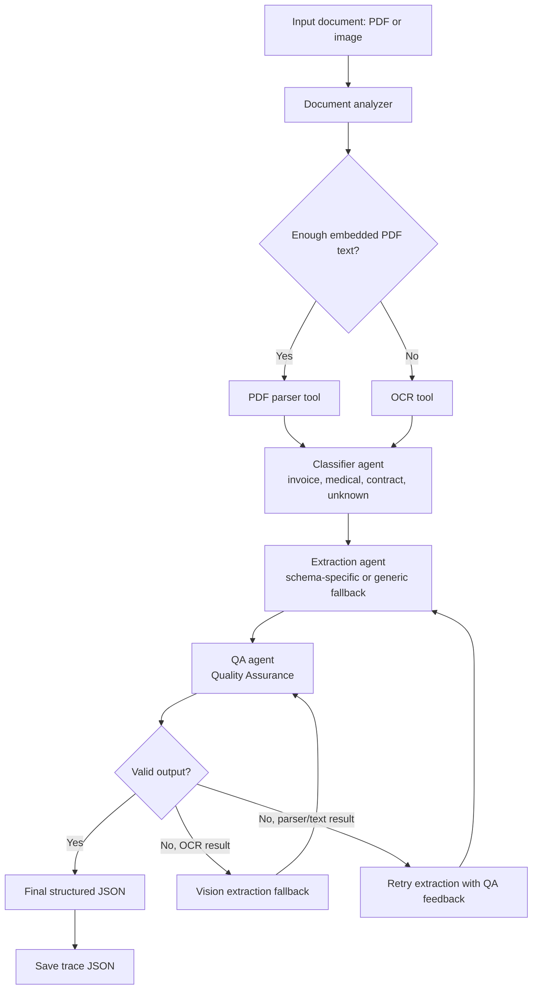

# Agent Run Report

## 1. Summary

This project implements an agentic document processing system for invoices, medical records, and contracts. The agent receives a PDF or image, decides whether to use embedded PDF text or OCR, classifies the document type, extracts structured fields with an LLM, validates the output, and records a complete decision trace.

The implementation uses:

- LangGraph for workflow orchestration.
- Groq chat models through LangChain.
- Pydantic schemas for structured extraction.
- PyMuPDF for PDF inspection and parsing.
- Tesseract OCR for scanned PDFs and image documents.
- A QA (Quality Assurance) and reflection loop for validation and retry decisions.
- Provider tool-call recovery for structured-output failures that contain usable JSON.
- Chunked extraction and merge for large searchable PDF text.
- JSON trace files for observability.

The project also includes a Streamlit UI, a Dockerfile, evaluation scenarios, and saved evaluation results.

## 2. Assignment Requirements Mapping

| Requirement | Implementation |
| --- | --- |
| Agent goal, tools, and decision flow | Defined through `src/graph/workflow.py`, `src/agents/`, and `src/tools/`. |
| Architecture diagram | Included below in Mermaid format. |
| Reason-plan-act-observe-respond loop | Document analyzer/planner reason and plan, tools act, QA observes, reflector responds. |
| At least one tool/function call | PDF parser, OCR tool, document analyzer, and optional vision extraction. |
| Prompt engineering | Prompts are separated by agent and document type under `src/prompts/`. |
| Structured output parsing | LangChain `with_structured_output()` with Pydantic schemas. |
| Advanced technique | Multi-agent collaboration plus QA/reflection self-critique loop. |
| LLM failure handling | Configured fallback models, low-temperature LLM calls, structured fallback responses, provider tool-call recovery, and vision failure preservation. |
| Input validation and guardrails | File validation, supported file-type checks, required-field QA, confidence checks, unknown-document fallback. |
| Logging/tracing | Per-agent logs stored in workflow state and persisted to `logs/runs/`. |
| Evaluation scenarios | Seven scenarios in `evaluation/scenarios.json`. |
| Lightweight evaluation | `evaluation/evaluate.py` compares document type, selected tool, required fields, and QA score. |
| README and setup commands | Provided in `README.md`. |

## 3. Architecture Diagram



## 4. Agent Loop

The workflow implements the assignment's agent loop as follows:

| Loop Step | Project Component | Behavior |
| --- | --- | --- |
| Reason | Document analyzer and planner | Inspect document metadata and produce a concise route-selection summary. |
| Plan | Planner agent | Use structured LLM planning to select `PDF_PARSER` or `OCR`, with deterministic metadata rules as fallback. |
| Act | PDF parser, OCR, classifier, extractor | Extract text, classify document type, and produce structured fields. |
| Observe | QA (Quality Assurance) agent | Check required fields, low-confidence values, and extraction warnings. |
| Respond | Reflection agent | Finalize, retry extraction, or trigger vision fallback. |

The workflow is assembled in `src/graph/workflow.py`. Routing logic lives in `src/graph/router.py`, and shared state is defined in `src/graph/state.py`.

## 5. Tools and Agents

### Tools

- **Document Analyzer**: inspects file name, extension, size, PDF page count, embedded text length, and image count.
- **PDF Parser**: extracts embedded text from searchable PDFs using PyMuPDF.
- **OCR Tool**: uses Tesseract to extract text from image files and rendered PDF pages.
- **Vision Extraction Agent**: fallback path for weak OCR results. It sends the original image payload for image files, or renders the first PDF page to PNG for PDF fallback to avoid oversized raw PDF payloads.

### Agents

- **Planner Agent**: chooses the first extraction tool with structured LLM output, then falls back to deterministic metadata rules if the LLM is unavailable or returns an invalid decision.
- **Classifier Agent**: classifies text as invoice, contract, medical, or unknown.
- **Extraction Agent**: uses document-specific prompts and schemas to produce structured JSON. For large searchable PDF text, it extracts page-aware chunks and merges them into one final schema-compatible result.
- **QA Agent**: the Quality Assurance agent validates required fields, confidence values, extraction warnings, and whether the output is acceptable for finalization.
- **Reflection Agent**: decides whether to finalize, retry, or invoke the vision fallback.

## 6. Prompt Engineering and Structured Output

Prompts are separated by responsibility:

- `src/prompts/planner.py`
- `src/prompts/classifier.py`
- `src/prompts/extractor.py`
- `src/prompts/extractors/invoice.py`
- `src/prompts/extractors/contract.py`
- `src/prompts/extractors/medical.py`
- `src/prompts/qa.py`
- `src/prompts/reflector.py`

The extraction agent chooses the schema after classification:

- `InvoiceExtraction`
- `ContractExtraction`
- `MedicalExtraction`
- Generic `DocumentExtraction` fallback

Structured output uses Pydantic models with confidence and evidence fields. This makes the result easier to validate and inspect than free-form text.

Groq calls are configured with `GROQ_TEMPERATURE`, which defaults to `0.1`, to keep classification and extraction mostly deterministic while still allowing a small amount of model flexibility.

The traces contain concise reasoning summaries and agent events. They are designed as an observable decision trace: planner choices, tool calls, validation results, retry decisions, and final outputs are recorded without exposing hidden chain-of-thought.

## 7. Robustness and Error Handling

The project includes several practical failure-handling paths:

- Missing files raise clear errors during document analysis.
- Unsupported OCR file types raise explicit tool errors.
- LLM classification and extraction can try fallback models from `GROQ_FALLBACK_MODELS`.
- Extraction catches provider tool-call failures and recovers valid JSON when the provider error contains a parseable structured payload. Recovery also normalizes common shape issues, such as a string where an extracted-field object is expected, or a wrapped list where a list is expected.
- Large searchable PDF text is split into page-aware chunks and merged into a final structured result when the extracted text exceeds configured page or character thresholds.
- QA (Quality Assurance) prevents finalization when required fields are missing or confidence is too low.
- Reflection retries weak extraction results up to the configured retry limit.
- OCR failures can trigger a vision fallback path.
- If the vision fallback fails after an OCR attempt, the previous OCR result is preserved with a warning rather than discarded.

One known trade-off: PDF vision fallback currently renders only the first page. This avoids payload-size failures, but it does not inspect every page of a scanned multi-page PDF.

## 8. Observability and Trace Format

CLI, evaluation, and Streamlit runs save JSON traces under:

```text
logs/runs/
```

Each trace includes:

- UTC timestamp.
- Input file path.
- Document metadata.
- Selected tool.
- Planner decision summary.
- Structured output.
- Validation result.
- Retry count.
- Per-agent logs.
- Error field, when present.

Example trace file:

```text
logs/runs/20260801T190702Z_invoice_test_0002_trace.json
```

Sample agent trace from an OCR invoice run:

```json
[
  {
    "agent": "document_analyzer",
    "message": "Document metadata collected.",
    "metadata": {
      "metadata": {
        "file_name": "invoice_test_0002.jpg",
        "file_extension": ".jpg",
        "file_size_bytes": 220646,
        "page_count": 0,
        "text_length": 0,
        "has_embedded_text": false,
        "image_count": 0,
        "is_pdf": false
      }
    }
  },
  {
    "agent": "planner",
    "message": "Planner selected extraction tool.",
    "metadata": {
      "selected_tool": "OCR",
      "reasoning": "Little or no embedded text was found, so OCR is the best first tool.",
      "confidence": 0.85
    }
  },
  {
    "agent": "ocr_tool",
    "message": "OCR extracted text from rendered document pages.",
    "metadata": {
      "character_count": 1013
    }
  },
  {
    "agent": "classifier",
    "message": "Classification completed.",
    "metadata": {
      "document_type": "invoice",
      "model": "llama-3.1-8b-instant"
    }
  },
  {
    "agent": "extractor",
    "message": "Structured extraction recovered from provider tool-call error.",
    "metadata": {
      "document_type": "invoice",
      "model": "llama-3.1-8b-instant"
    }
  },
  {
    "agent": "qa",
    "message": "QA validation completed.",
    "metadata": {
      "is_valid": true,
      "missing_fields": [],
      "quality_score": 1.0
    }
  },
  {
    "agent": "reflector",
    "message": "Reflection completed. Extraction is acceptable for final response.",
    "metadata": {
      "is_valid": true,
      "quality_score": 1.0
    }
  }
]
```

The extractor recovery message means the provider returned a structured tool-call error, but the error body still contained valid JSON. The extractor parsed that JSON, validated it against the Pydantic schema, and continued successfully.

## 9. Sample Final Output

Sample structured output from the OCR invoice scenario:

```json
{
  "invoice_number": {
    "value": "12847181",
    "confidence": 0.95,
    "evidence": "Invoice no: 12847181"
  },
  "invoice_date": {
    "value": "03/03/2012",
    "confidence": 0.8,
    "evidence": "03/03/2012"
  },
  "vendor_name": {
    "value": "Fitzpatrick and Sons",
    "confidence": 0.95,
    "evidence": "Seller: Fitzpatrick and Sons"
  },
  "customer_name": {
    "value": "Duncan PLC",
    "confidence": 0.95,
    "evidence": "Client: Duncan PLC"
  },
  "subtotal": {
    "value": "$6,860.45",
    "confidence": 0.9,
    "evidence": "$ 6 860,45"
  },
  "tax": {
    "value": "10%",
    "confidence": 0.95,
    "evidence": "VAT [%] 10%"
  },
  "total_amount": {
    "value": "$6,860.45",
    "confidence": 0.9,
    "evidence": "$ 6 860,45"
  }
}
```

## 10. Evaluation

Evaluation scenarios are defined in:

```text
evaluation/scenarios.json
```

The evaluator is:

```text
evaluation/evaluate.py
```

Run command:

```bash
python evaluation/evaluate.py --scenarios evaluation/scenarios.json
```

The evaluation checks expected document type, expected extraction tool, required structured fields, and QA quality score.

QA means Quality Assurance. The QA score summarizes whether the extracted output has required fields, adequate confidence, and no blocking extraction warnings.

Current scenarios:

| ID | File | Expected Type | Expected Tool | Required Fields |
| --- | --- | --- | --- | --- |
| `invoice_simple` | `sample_docs/invoice_simple.pdf` | `invoice` | `PDF_PARSER` | invoice number, invoice date, vendor name, total amount |
| `medical_discharge` | `sample_docs/medical_discharge.pdf` | `medical` | `PDF_PARSER` | patient name, visit date, provider name |
| `contract_nda` | `sample_docs/contract_nda.pdf` | `contract` | `PDF_PARSER` | contract title, effective date |
| `invoice_image_ocr` | `sample_docs/invoice_test_0002.jpg` | `invoice` | `OCR` or `VISION_LLM` | invoice number, invoice date, vendor name, total amount |
| `unknown_test_sample` | `sample_docs/test_sample.pdf` | `unknown` | `PDF_PARSER` | none |
| `invoice_image_ocr_0007` | `sample_docs/invoice_test_0007.jpg` | `invoice` | `OCR` or `VISION_LLM` | invoice number, invoice date, vendor name, total amount |

Last saved evaluation result:

```json
[
  {
    "id": "invoice_simple",
    "passed": true,
    "actual_document_type": "invoice",
    "actual_tool": "PDF_PARSER",
    "missing_required_fields": [],
    "quality_score": 1.0
  },
  {
    "id": "medical_discharge",
    "passed": true,
    "actual_document_type": "medical",
    "actual_tool": "PDF_PARSER",
    "missing_required_fields": [],
    "quality_score": 1.0
  },
  {
    "id": "contract_nda",
    "passed": true,
    "actual_document_type": "contract",
    "actual_tool": "PDF_PARSER",
    "missing_required_fields": [],
    "quality_score": 1.0
  },
  {
    "id": "invoice_image_ocr",
    "passed": true,
    "actual_document_type": "invoice",
    "actual_tool": "OCR",
    "missing_required_fields": [],
    "quality_score": 1.0
  },
  {
    "id": "unknown_test_sample",
    "passed": true,
    "actual_document_type": "unknown",
    "actual_tool": "PDF_PARSER",
    "missing_required_fields": [],
    "quality_score": 0.85
  },
  {
    "id": "invoice_image_ocr_0007",
    "passed": true,
    "actual_document_type": "invoice",
    "actual_tool": "OCR",
    "missing_required_fields": [],
    "quality_score": 1.0
  }
]
```

The full saved result is available at:

```text
evaluation/evaluation_results.json
```

## 11. Design Decisions and Trade-Offs

- **LangGraph orchestration**: chosen because this task has clear state transitions, branches, and retry routing.
- **PDF parser before OCR**: searchable PDFs are faster and usually more accurate with direct text extraction.
- **OCR path for images and scanned files**: supports documents without embedded text.
- **Document-specific prompts**: reduces schema confusion and keeps prompts focused.
- **Pydantic schemas**: make extraction outputs machine-checkable.
- **Low LLM temperature**: `GROQ_TEMPERATURE` defaults to `0.1` for more repeatable structured output.
- **Large searchable PDF chunking**: page-aware text chunks reduce oversized prompt failures while preserving the existing one-record output shape.
- **QA and reflection loop**: provides a practical Quality Assurance/self-critique mechanism without relying on hidden reasoning.
- **Vision fallback only after OCR weakness**: avoids unnecessary multimodal calls when OCR is already good enough. PDF fallback renders only the first page to keep payloads small.
- **Trace preservation**: every run stores the observable workflow decisions and final result for review.
